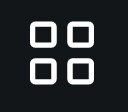

---

copyright:
  years: 2018, 2021
lastupdated: "2021-11-11"

keywords: IBM Blockchain Platform, video series, videos, getting started videos, demo videos

subcollection: blockchain-sw-252

---

{{site.data.keyword.attribute-definition-list}}

{:table:.aria-labeledby="caption"}

# {{site.data.keyword.blockchainfull_notm}} Platform getting started videos
{: #ibp-videos}

You can watch the getting started video series to learn more about how to use {{site.data.keyword.blockchainfull}} Platform.
{: shortdesc}

## Getting started with {{site.data.keyword.blockchainfull_notm}} Platform 2.5.2
{: #ibp-videos-ibp-v2}

Watch the following [video series]( http://ibm.biz/BlockchainPlatformSeries) to learn more about the {{site.data.keyword.blockchainfull_notm}} Platform and how you can get started to build your own network.

    

        <a href = "https://developer.ibm.com/videos/deploy-a-peer-on-the-ibm-blockchain-platform/">
        

        
<strong> Deploy a peer

        
Learn how to use the console to deploy a peer into your IBM Kubernetes cluster. Before you create the peer, you need to create a CA and use it to create identities and an organization definition.

        

    </a>
    

    

        <a href = "https://developer.ibm.com/videos/deploy-an-ordering-service-on-the-ibm-blockchain-platform/">
        

        
<strong> Deploy an ordering service

        
Learn how to use the console to deploy a peer into your IBM Kubernetes cluster. Before you create the peer, you need to create a CA and use it to create identities and an organization definition.

        

    </a>
    

    

        <a href = "https://developer.ibm.com/videos/create-and-join-a-channel-on-the-ibm-blockchain-platform/">
        

        
<strong> Create and join a channel

        
Learn how to use the console to join a peer organization to a consortium on the ordering service, create a channel and select channel members, and then join a peer to the channel.

        

    </a>
    

